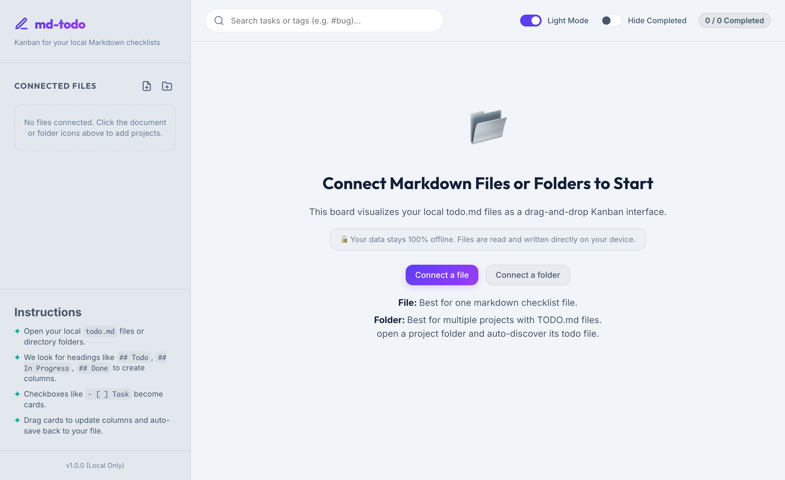
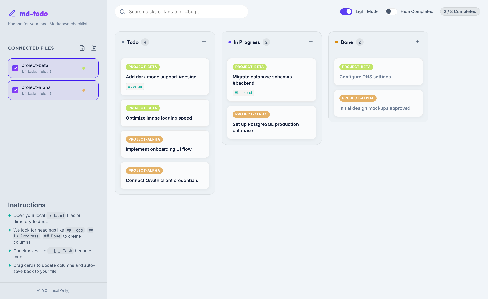
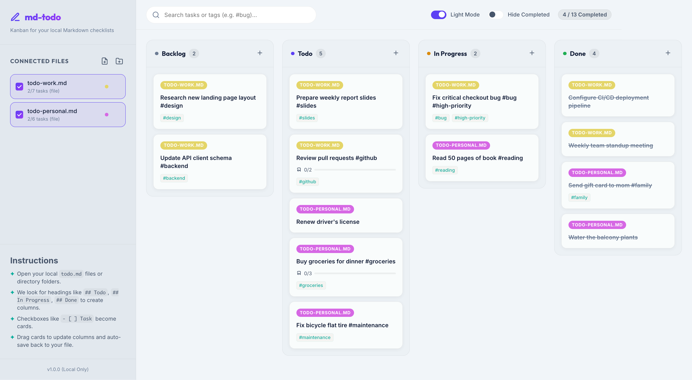
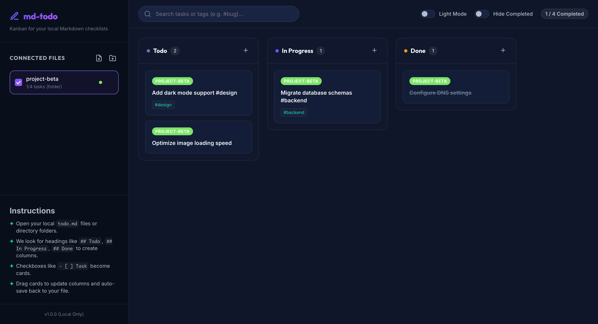
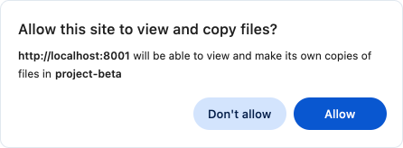
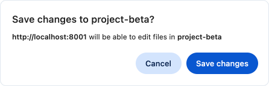

# md-todo

A lightweight offline Markdown Kanban board for local todo checklists.

`md-todo` lets you connect markdown checklist files or project folders and view them as a drag-and-drop kanban board in the browser. Changes are saved directly back to your local markdown file using the browser File System Access API.

## Features



- Connect a single markdown checklist file like `todo.md`
- Connect a project folder and auto-discover its markdown checklist file
- Parse Markdown headings into kanban columns
- Parse Markdown checkboxes into task cards
- Drag tasks between columns and reorder within a column
- Edit task title, description, tags, and subtasks in a modal
- Hide completed tasks
- Search tasks and tags
- Persist file/folder handles across reloads using IndexedDB
- 100% offline/local file storage, no external server required


## Run locally

### Method 1. Just double click on ```start.command```

### Method 2. From the project root:

```bash
./start.command
```


## How it works

### Core flow

1. The app loads from `index.html` and starts in the browser as an ES module app.
2. `src/main.js` manages the global state and renders the sidebar, board, and task stats.
3. `src/file-system.js` handles file/directory access via the File System Access API and stores connection handles in IndexedDB.
4. `src/parser.js` converts markdown content into structured project data and re-serializes it back into markdown when saving.
5. `src/components/sidebar.js` renders project connections and selector UI.
6. `src/components/kanban.js` renders board columns, task cards, drag-and-drop behavior, and empty states.
7. `src/components/modal.js` handles the task edit/create modal.

### Markdown conventions

- Headings like `## Todo`, `## In Progress`, `## Done` become kanban columns.
- Checklist items like `- [ ] Task` or `- [x] Done` become task cards.
- Indented `- [ ]` items under a task are treated as subtasks.
- Tags are extracted from `#tag-name` tokens in task text.

## Screenshots







## Permissions
You will be asked to give permission to this app to edit your MD files

### Files


### Folders





## Browser support

`md-todo` requires a Chromium-based browser that supports the File System Access API, such as:

- Google Chrome
- Microsoft Edge
- Opera

It must be served over HTTP (or localhost) rather than opened as a raw `file://` page.

Then open the served page in a supported browser.

## Project structure

- `index.html` — app shell and UI scaffolding
- `styles.css` — application styling
- `src/main.js` — app state, render orchestration, save logic
- `src/file-system.js` — File System Access API and IndexedDB helpers
- `src/parser.js` — markdown parsing and compilation
- `src/components/sidebar.js` — sidebar UI and project management
- `src/components/kanban.js` — board rendering, drag/drop, empty states
- `src/components/modal.js` — task editing modal

## Contributing

Contributions are welcome! Suggested improvements include:

- richer markdown compatibility
- better folder discovery logic
- keyboard shortcuts and accessibility enhancements
- more task metadata support

## License

This project is licensed under the Apache License 2.0.

See the `LICENSE` file for details.
